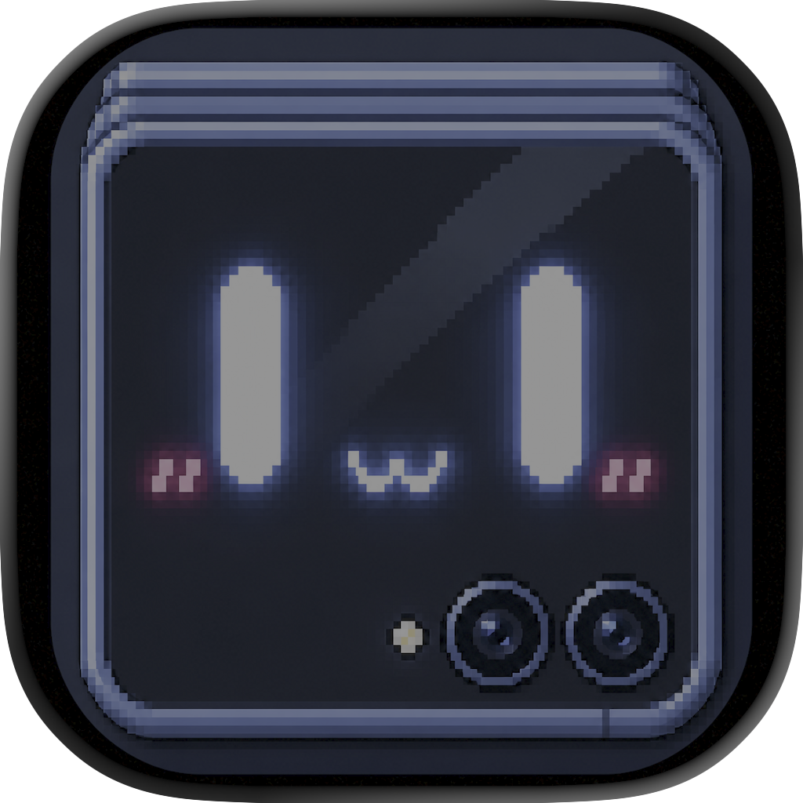

<p align="center">
  
</p>

<h1 align="center">MiniDex</h1>

<p align="center">
  <strong>Turn your Samsung Galaxy Z Flip7 cover screen (FlexWindow) into a tactile keyboard and touchpad for Samsung DeX.</strong>
</p>

<p align="center">
  <a href="https://github.com/RimorCosmicam/miniDex/actions/workflows/build.yml"></a>
  
  
</p>

---

## 🌟 Overview

**MiniDex** is built specifically for one core mobile-desktop workflow:

1. **Samsung Galaxy Z Flip7 is folded.**
2. **Samsung DeX is active on an external display** (monitor, TV, or AR glasses).
3. **MiniDex runs directly on the FlexWindow cover screen.**
4. The cover screen becomes an instant, low-latency, tactile **Keyboard & Touchpad** controller for DeX.

The **cover screen is the product**. MiniDex is crafted around the physical geometry of the Z Flip7 FlexWindow, taking advantage of the bottom-left camera safe space for effortless mode switching without getting in the way of your typing or tracking.

---

## 🚀 Key Features

### 🔀 Instant 2-Mode Switching
- **Keyboard Mode** ⇄ **Touchpad Mode** via a single persistent switch button nestled in the bottom-left camera notch safe area.
- No menus, no radial selectors, no latency. Tap once to swap.

### ⌨️ Mobile-Optimized Cyber Keyboard
- **Tap-to-Hold / Latched Modifiers**:
  - Tap `Shift`, `Ctrl`, `Alt`, or `⊞ Win` to latch for the next key press (one-shot).
  - Double-tap to lock (e.g. Caps Lock or continuous Ctrl shortcuts).
  - Tap locked modifier to release. Clear visual badges on keycaps.
- **Custom Keyboard Pages**:
  - **ABC**: QWERTY layout with secondary symbols and optimized touch targets.
  - **123**: Complete desktop punctuation, math symbols, brackets, braces, and backticks.
  - **NAV**: Full desktop navigation cluster (Arrow D-Pad, F1–F12, Home, End, PgUp, PgDn, Ins, PrtScn, Win+Tab, Alt+Tab, Alt+F4).
  - **MACROS**: Programmable grid of macro buttons (Copy, Paste, Undo, Task Manager, Run Terminal, Screenshot, Desktop, Close).
  - **SETTINGS**: Embedded directly in the cover UI.
- **Persistent Special Row**: `ESC`, `TAB`, `CTRL`, `ALT`, `WIN`, `DEL`, `←`, `↑`, `↓`, `→` always within thumb reach.

### 🖱️ Ultra-Responsive Relative Touchpad
- **Maximized Pointer Surface**: The entire AMOLED display acts as a relative trackpad.
- **Touchpad Kinematics**: Non-linear pointer acceleration curve ($v_{accel} = v \cdot (1 + \alpha |v|)$) and customizable sensitivity.
- **Desktop Gestures**:
  - **Single Tap**: Left Click
  - **Double Tap**: Double Click
  - **Tap-and-Drag**: Drag lock / Window move & text selection
  - **Two-Finger Drag**: Vertical & horizontal smooth scrolling (with Natural Scrolling toggle)
  - **Two-Finger Tap**: Right Click
  - **Tactile Haptic Feedback**: Crisp physical-feeling click vibrations on tap and drag.

### 🖥️ Smart DeX Display Detection & Input Backends
- **Auto-Discovery**: Automatically listens to `DisplayManager` for external presentation monitors, HDMI/DP displays, or wireless DeX sessions.
- **Display Targeting**: Injects key and motion events explicitly tagged with the target DeX `displayId`.
- **Injection Backends**:
  1. **Shizuku Privileged Backend** (*Recommended for DeX direct hardware injection*): Uses `IInputManager` binder with `InputEvent.setDisplayId` to send low-level events straight to DeX.
  2. **Virtual Device Framework** (Android 13+).
  3. **Simulator / Fallback Backend**: Safe local testing mode.

---

## 🛠️ Setup & Requirements

### 1. Target Device & OS
- **Target Device**: Samsung Galaxy Z Flip7 (also compatible with Z Flip5 & Z Flip6).
- **OS**: Android 14 / Android 15 / Android 16 (One UI 6.x / 7.x / 8.x).

### 2. FlexWindow / Cover Screen Setup
To launch MiniDex on the Z Flip cover screen:
1. Install **Good Lock** from the Samsung Galaxy Store.
2. Open Good Lock and install the **MultiStar** module.
3. Open MultiStar → **I ♡ Galaxy Foldable** → **Launcher Widget**.
4. Enable **MiniDex** in the widget apps list.
5. Fold your device, swipe to the MultiStar widget on FlexWindow, and launch MiniDex!

### 3. Shizuku Setup (For Privileged DeX Event Injection)
Because Android isolates input injection across different displays for security, MiniDex uses Shizuku to inject real hardware `KeyEvent` and `MotionEvent` instances into the DeX external display without requiring root:
1. Install [Shizuku](https://shizuku.rikka.app/) from Google Play or GitHub.
2. Start Shizuku via **Wireless Debugging** (Settings → Developer Options → Wireless Debugging) or ADB.
3. Open MiniDex, switch to **SETTINGS** page, and tap **Grant Shizuku**.

---

## 🏗️ Building Locally

### Prerequisites
- JDK 17 or higher
- Android SDK with Platform 35 (`android-35`) and Build Tools `35.0.0`

### Build Commands
```bash
# Clone the repository
git clone https://github.com/RimorCosmicam/miniDex.git
cd miniDex

# Run Unit Tests
./gradlew test

# Assemble Debug APK
./gradlew assembleDebug

# Output APK will be at:
# app/build/outputs/apk/debug/app-debug.apk
```

---

## 🤖 GitHub Actions CI/CD

MiniDex is fully configured to build continuously in GitHub Actions.
- **CI Workflow** (`.github/workflows/build.yml`): Runs on every push and pull request, executes unit tests, builds the debug APK, and uploads it as a downloadable artifact.
- **Release Workflow** (`.github/workflows/release.yml`): Triggers when a version tag (`v*.*.*`) is pushed, assembling release APKs and publishing a GitHub Release.

---

## 📂 Project Architecture

```
miniDex/
├── Icon/                                # High-resolution source icons
├── app/
│   ├── src/main/
│   │   ├── AndroidManifest.xml          # Samsung cover screen & Shizuku manifest entries
│   │   ├── java/com/minidex/app/
│   │   │   ├── data/                    # DataStore preferences & Macro repository
│   │   │   ├── dex/                     # DexDisplayManager (DisplayManager listener & heuristic detection)
│   │   │   ├── domain/model/            # Modifiers, KeyActions, Macros, Touchpad gestures
│   │   │   ├── input/                   # InputBackend interface, ShizukuBackend, VirtualDevice, Fallback
│   │   │   ├── ui/
│   │   │   │   ├── components/          # KeyButton, ModeSwitcherButton, PageBar, SpecialRow, Haptics
│   │   │   │   ├── keyboard/            # QwertyKeyboard, SymbolKeyboard, NavKeyboard, MacropadView
│   │   │   │   ├── touchpad/            # TouchpadView, TouchpadKinematics (acceleration & scroll physics)
│   │   │   │   ├── settings/            # SettingsView & MacroEditorDialog
│   │   │   │   ├── theme/               # Cyber OLED colors, typography, MaterialTheme
│   │   │   │   └── main/                # MainCoverActivity, MainViewModel, MainScreen
│   │   └── res/                         # App icon mipmaps, drawables, styles, and themes
│   └── build.gradle.kts
├── gradle/
│   ├── libs.versions.toml               # Version catalog (Compose BOM, Kotlin 2.0, Shizuku)
│   └── wrapper/                         # Gradle 8.11.1 wrapper
├── .github/workflows/                   # Automated build & release workflows
└── README.md
```

---

## 📄 License
MiniDex is open source under the Apache License 2.0.
