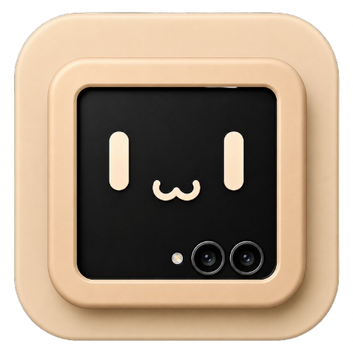

# MiniDex

Your folded phone, driving your desktop.

MiniDex turns the cover display of a Samsung Galaxy Z Flip into a touchpad and a
keyboard for Samsung DeX running on an external screen.

Built for the Galaxy Z Flip 7 FlexWindow.

## What it does

- **Touchpad** — pointer, tap to click, drag, two-finger scroll and right click,
  over a halftone field that bends and refracts under the edge controls.
- **Scroll rail and click corner** — along the edge and in the corner, where your
  thumb already is, so the whole thing works one-handed. Both are real glass:
  the field behind them is refracted, not covered.
- **Keyboard** — swipe typing, symbols, a navigation cluster and a macro pad,
  with tap-to-latch and double-tap-to-lock modifiers.
- **Macros** — key chords and text snippets, editable on the cover screen.

Everything is aimed at the external DeX display, not the phone.

## Drivers

MiniDex needs a way into DeX, and it has three. Onboarding sets them up and
reports which are live.

- **Wireless ADB** — hardware injection, lowest latency. Pairs on-device: mDNS
  finds the port, you type the six-digit code, and the pairing strip floats over
  Android's own debugging screen so the code and the field are visible at once.
  Once paired it reconnects on the stored key with no code at all.
- **Accessibility** — gesture dispatch, and the window the pairing strip floats
  in. No pairing needed.
- **Keyboard IME** — types into DeX windows.

## Mont

The whole interface is [Mont](https://github.com/RimorCosmicam/Mont): black at
92%, white carrying every level of hierarchy through opacity alone, corner
radius zero, and Mont Black as the default weight rather than an emphasis one.
No cards, no pills, no gradients, no shadows. Selected is simply the bright one.

The background is one scene — Minimal / Halftone, carried over from
[miniMate](https://github.com/RimorCosmicam/miniMate) — in sixteen colourways.
Mustard is the default, because it is the language's poster colour.

## Building

```
./gradlew assembleDebug
```

GitHub Actions builds and tests every push. Take the APK from the run:

```
gh run download <run-id> -R RimorCosmicam/miniDex -n minidex-debug-apk
```

## Getting it on the cover screen

Install Good Lock, add the MultiStar module, then
**I ♡ Galaxy Foldable → Launcher Widget** and enable MiniDex. Fold the phone,
swipe to the widget, launch.

## Open source

Apache 2.0. Do what you like with it (but let me know, I love cool stuff).

The Mont typeface is a commercial face from Fontfabric and is **not** covered by
that licence — check yours before shipping anything built from this.
